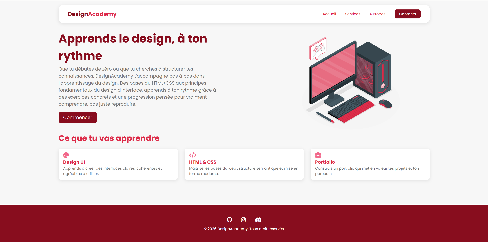

# Learn bases of FrontEnd

Petit projet d'initiation aux bases du HTML et CSS, réalisé pour progresser sur le frontend. Il s'agit d'une page vitrine fictive ("DesignAcademy") sans direction artistique préétablie : l'objectif est avant tout de pratiquer les fondamentaux (structure sémantique, Flexbox, Grid, variables CSS, responsive) plutôt que d'obtenir un design fini.

## 🖼️ Aperçu



## 🎯 Objectif du projet

Reprendre les bases HTML/CSS pas à pas, en construisant une page composant par composant (navbar, hero, section services, footer...), afin de mieux comprendre *pourquoi* on écrit tel ou tel code, plutôt que de simplement reproduire un tutoriel.

## 🛠️ Technologies utilisées

- **HTML5** — structure sémantique (`header`, `main`, `section`, `footer`, `nav`)
- **CSS3** — Flexbox, CSS Grid, variables CSS (custom properties), transitions, `position: sticky`/`absolute`, media queries
- **JavaScript** — manipulation du DOM (`querySelector`, `addEventListener`, `classList.toggle`) pour le menu burger
- **[Font Awesome](https://fontawesome.com/)** — icônes solid et brands (via CDN)
- **Google Fonts** — police [Poppins](https://fonts.google.com/specimen/Poppins)
- Illustrations vectorielles [unDraw](https://undraw.co/illustrations)

## 📄 Structure de la page

- **Navbar** — logo, menu de navigation, bouton d'action, avec ombre douce, coins arrondis, et `position: sticky` pour rester visible au scroll. Devient un menu burger sur mobile (voir section Responsive)
- **Hero** — titre, texte de présentation, bouton CTA, illustration (mise en page deux colonnes via Flexbox, empilée sur mobile)
- **Services** — 3 cartes (Design UI, HTML & CSS, Portfolio) alignées en grille via CSS Grid, avec animation de zoom au survol (une colonne sur mobile)
- **Footer** — copyright et liens vers GitHub/Instagram/Discord, en pleine largeur (hors du padding global de la page) et toujours collé en bas de l'écran

## 📱 Responsive

Breakpoint mobile géré via `@media (max-width: 768px)`, testé sur une largeur de référence de 375px. Les trois zones de la page sont adaptées :

- **Navbar mobile** : le menu horizontal est remplacé par un bouton burger (icône Font Awesome `fa-bars`)
  - Le menu déroulant (`.menu ul.active`) s'affiche en `position: absolute` sous le header, avec fond blanc, `box-shadow` et `border-radius` cohérents avec le reste du design
  - Ouverture/fermeture gérée en JavaScript : `querySelector` pour cibler le bouton et la liste, `addEventListener('click', ...)` pour écouter le clic, `classList.toggle('active')` pour basculer l'affichage
  - `gap` et `justify-content: flex-start` appliqués au `header` en mobile pour un espacement/alignement propre entre burger et logo
- **Hero mobile** : `flex-direction: column` sur `.hero-wrapper` pour empiler le texte au-dessus de l'illustration
  - `padding` du texte remis à 0 (devenu inutile en colonne)
  - Tailles de police réduites (titre, paragraphe, bouton) pour s'adapter à l'écran
  - Illustration masquée (`display: none`) pour alléger la page sur mobile
- **Services mobile** : `grid-template-columns: 1fr` pour empiler les 3 cartes verticalement
  - `margin-bottom` ajouté sur `.service-wrapper` pour garder un espace correct avant le footer

## 🎨 Palette de couleurs

Palette monochromatique rouge/bordeaux, générée avec [Coolors](https://coolors.co/), gérée via variables CSS :

| Variable | Couleur | Usage |
|---|---|---|
| `--color-dark` | `#880d1e` | Éléments les plus importants (titre, logo, bouton CTA, fond du footer) |
| `--color-medium` | `#dd2d4a` | Éléments secondaires (liens, titres de section, icônes) |
| `--color-light` | `#f26a8d` | États hover |
| `--color-white` | `#ffffff` | Fond des cartes / header / texte sur fond foncé |
| `--color-background` | `#f7f7f7` | Fond général de la page |
| `--color-medium-gray` | `#777777` | Texte secondaire (paragraphes) |

## 📁 Fichiers

```
├── index.html
├── style.css
├── script.js
└── images/
    └── modern desktop computer-amico.png
```

## 🚀 Lancer le projet

Ouvrir `index.html` dans un navigateur, ou servir le dossier avec une extension type Live Server pour un rechargement automatique.

## 📚 Notions pratiquées

- Structure HTML sémantique et validité (ex : contenu correct d'un `<ul>`, hiérarchie des titres)
- Flexbox (alignement, répartition de l'espace avec `flex`, `flex-direction`, centrage selon l'axe)
- CSS Grid (`grid-template-columns`) pour une grille de cartes
- Variables CSS (`:root`, `var()`) et hiérarchisation d'une palette de couleurs
- `box-shadow`, `border-radius` pour un style "soft UI"
- Gestion d'images (`object-fit`, dimensionnement, centrage)
- `position: sticky` pour une navbar qui reste visible au scroll
- Animations et transitions (`transform: scale`, `transition`, fonctions de timing `ease`/`ease-in`/`ease-out`)
- Différence entre unités `%` et `vw`, utile pour faire déborder un élément (comme le footer) du padding d'un parent
- "Sticky footer" (footer toujours collé en bas même avec peu de contenu) via Flexbox sur `body`/`main`
- Hiérarchie de couleurs et contraste/accessibilité
- Responsive design complet : media queries, breakpoints, `position: absolute` pour un menu déroulant, adaptation de layout (Flexbox/Grid) et de typographie selon la taille d'écran
- Manipulation du DOM en JavaScript (`querySelector`, `addEventListener`, `classList.toggle`) pour un menu burger